<h1>Extracting and Cleaning Data</h1>

<h2>Description</h2>
Project consists of using Pandas to read the data (Normal.txt and Abnormal.txt) in as a dataframe, enabling us to structure the data into columns and rows. Then we will combine the two dataframes into a single dataframe and clean the data by removing any rows consisting of empty cells.
<br />


<h2>Languages and Utilities Used</h2>

- <b>Python</b> 

<h2>Environments Used </h2>

- <b>Ubuntu</b>

<h2>Program walk-through:</h2>

<p align="center">
Open the IPython QT Console with a monokai theme and to free up the terminal: <br/>
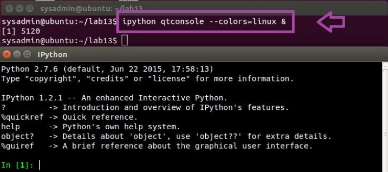
<br />
<br />
Load the Pandas and OS libraries and to create an alias for Pandas (pd):  <br/>
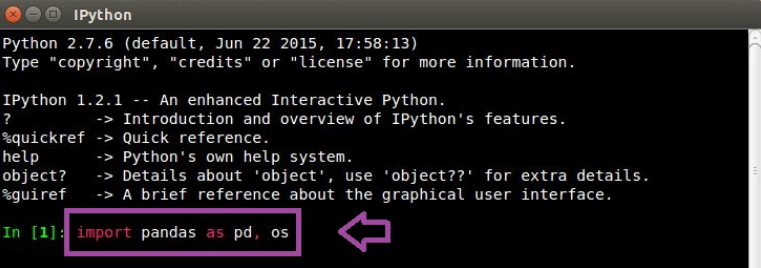
<br />
<br />
Change the current working directory to lab13: <br/>
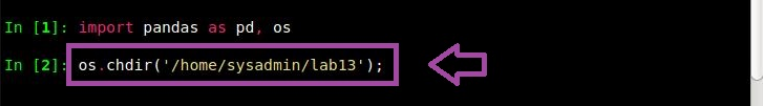
<br />
<br />
Read the data (Normal.txt) in as a dataframe and to let Pandas know that the data is not labeled:  <br/>
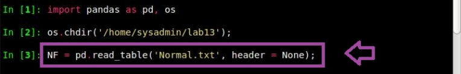
<br />
<br />
View the first 5 rows of the dataframe DF:  <br/>
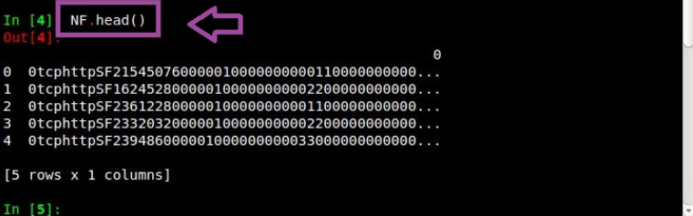
<br />
<br />
Assign an arbitrary name for the column:  <br/>
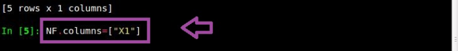
<br />
<br />
Read the data (Abnormal.txt) in as a dataframe and to let Pandas know that the data contains no labels:  <br/>
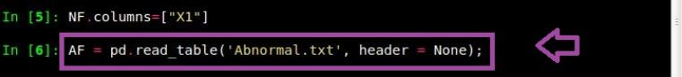
<br />
<br />
Assign the arbitrary name of X2 to the column: <br/>
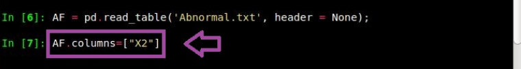
<br />
<br />
Return the number of rows and columns in the dataframe and compare the number of rows:  <br/>
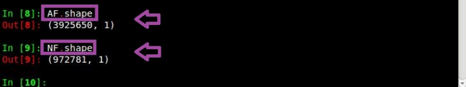
<br />
<br />
Append all the rows to itself 4x and to ignore the fact that the row numbering will not be unique: <br/>
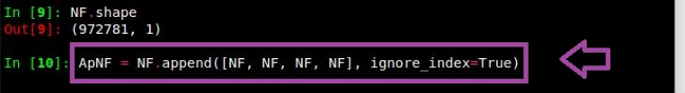
<br />
<br />
Verify the number has increased 4x:  <br/>
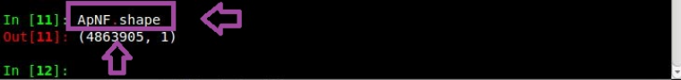
<br />
<br />
Concatenate the two dataframes together and axis=1 means to join columns:  <br/>
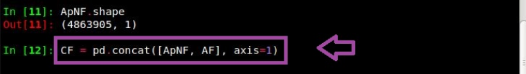
<br />
<br />
View the first 5 rows:  <br/>
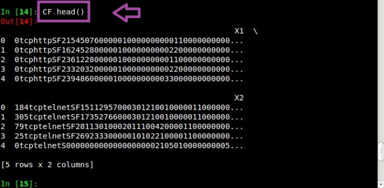
<br />
<br />
Drop any rows that contain empty cells:  <br/>
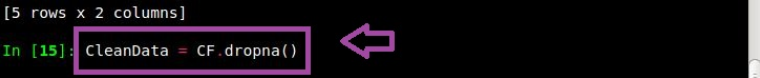
<br />
<br />
Verify the number of rows has decreased from 4863905 to 3925650:  <br/>
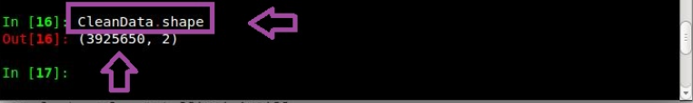
<br />
<br />
Quit:  <br/>
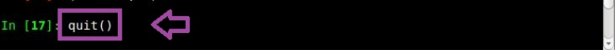
</p>

<!--
 ```diff
- text in red
+ text in green
! text in orange
# text in gray
@@ text in purple (and bold)@@
```
--!>
